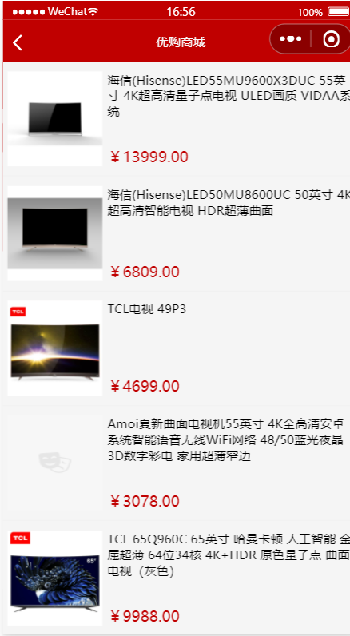

# 优选商城小程序

基于uni-app开发的优购商城小程序

## 技术栈
vue2+vuex+ES6/7+flex

## 功能

登录、首页、搜索、商品列表、商品详情页、购物车、个人中心

## 项目部分截图

### 首页

首页包括四个区域：搜索、轮播图、分类、商品大类介绍

### 商品列表

### 商品详情页

### 搜索

### 购物车

### 我的

#### 未登录

#### 登录

